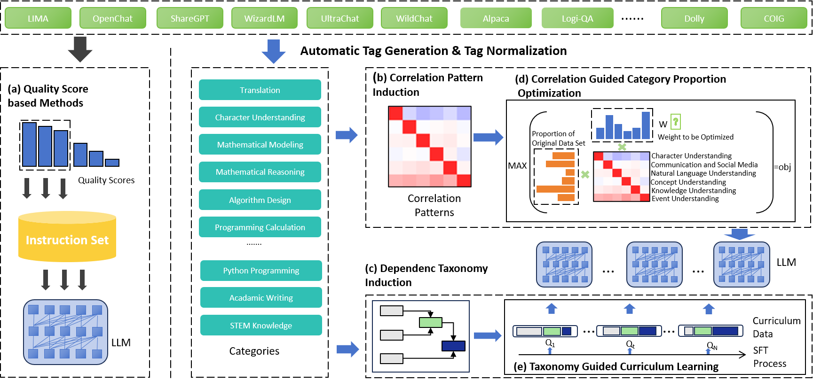
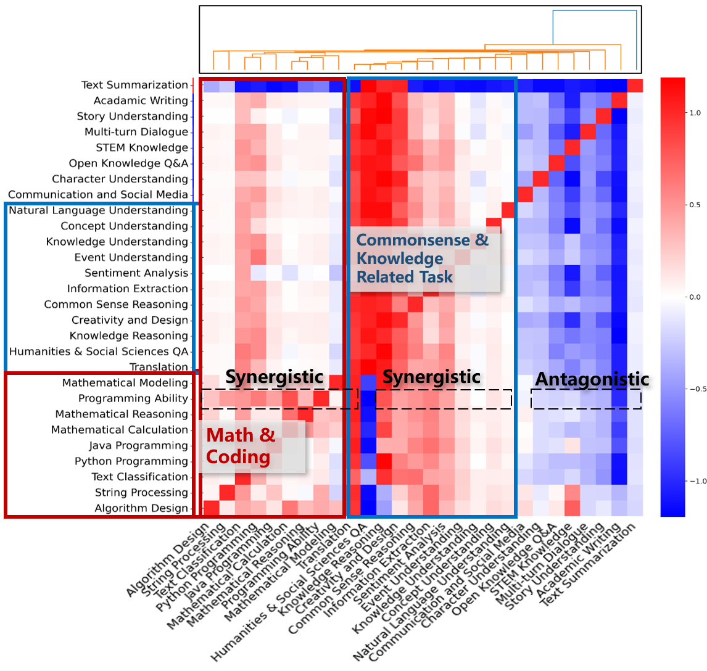
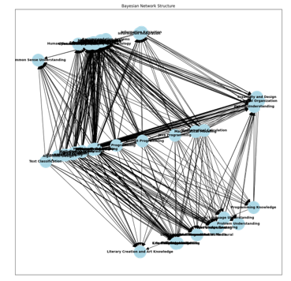
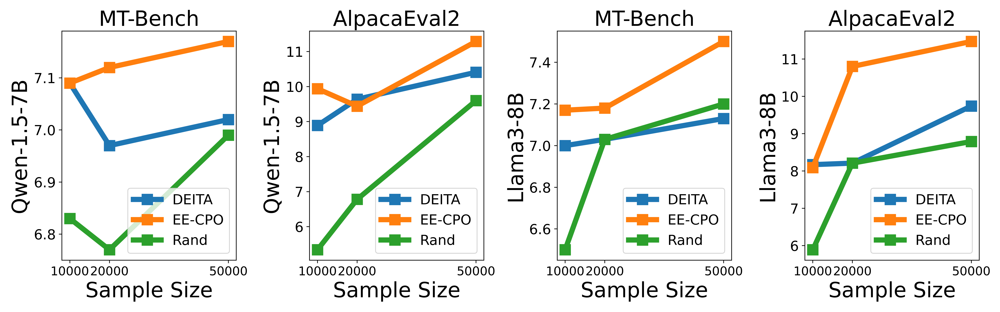
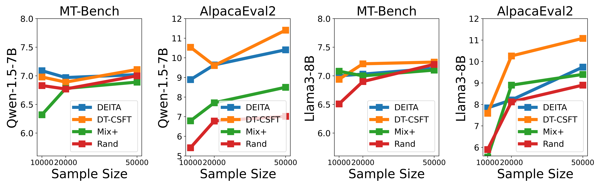

# Beyond IID: Optimizing Instruction Learning from the Perspective of Instruction Interaction and Dependency

This repository contains the codes and data to adjust the proportion of  SFT data according to their interaction and dependency.

> Link to paper: https://arxiv.org/pdf/2409.07045

## Intro

With the availability of various instruction datasets, a pivotal challenge is how to effectively select and integrate these instructions to fine-tune large language models (LLMs). Previous research mainly focuses on selecting individual high-quality instructions. However, these works overlooked the joint interactions and dependencies between different categories of instructions, leading to suboptimal selection strategies. Moreover, the nature of these interaction patterns remains largely unexplored, let alone optimize the instruction set with regard to them. To fill these gaps, we: 

(1) Systematically collect current availiable high quality English instruction sets and develop an automatic tagging system to label the instructions with tags describing necessary skills and knowledge to complete the instruction; 

(2) Systematically investigate interaction and dependency patterns between different categories of instructions; 

(3) Manage to optimize the instruction set concerning the interaction patterns using a linear programming-based method, and optimize the learning schema of SFT using an instruction dependency taxonomy guided curriculum learning. Experimental results across different LLMs demonstrate improved performance over strong baselines on widely adopted benchmarks.



## Results

We observe that:

(1) There are widespread interactions between different categories of instructions:



(2) Different catrgories of instructions are dependent rather than iid:



(3) We can further increase the effectiveness of instruction tuning by adjust the proportion of instruction set according to interaction patterns (EE-CPO in the below figure):



(4) By arranging different categories of instructions in a sequential manner, the efficiency of instruction can be prompted (DT-CSFT in the below figure). 



## Code & Data

We opensource the code of our approach, together with the instruction set optimized using them. Additionally, we release the whole instruction pool with tags indicating the categories of instructions. 

+ code for adjust proportion of instruction set: 

  ```
  python ./code/proportion_adjust.py
  ```

+ code for generating currilum data according to dependency

  ```
  python ./code/curriculum_data_gen.py
  ```

+ Datasets

  - We conduct experiments based on the collection of current availiable (date to 2024.3) high quality instruction sets. From the whole collection, we first measure the quality of instructions using temporarilt SoTA method Deita, and derive the 10K, 20K, and 50K instructions with top quality scores (named as: `deita_10k.jsonl`, `deita_20k.jsonl`, and `deita_50k.jsonl`).  
  - Then we adjusted the proportion of category and learning sequential of the above mentioned three datasets. The  category  proportion adjusted data and learning sequential adjusted data are stored in the `rebalanced_data` and `schedule_data` folder, respectively.
  - Moreover, we release the whole collection which English and Chinese category tags. This dataset can be downloaded at 
    - `rebalanced_data` ：https://cloud.189.cn/t/uYbiYbU7vIj2 （password：iai2）
    - `schedule_data` ：https://cloud.189.cn/t/nmYN3aIJNJ3a （password: qv83）
    - baseline deita datasets and the whole tagged pool: https://cloud.189.cn/t/ErMNVzEfUJz2 （password：ct6f）

## Citation

If you find our work helpful, please consider citing it:

```
@article{zhao2024beyond,
  title={Beyond IID: Optimizing Instruction Learning from the Perspective of Instruction Interaction and Dependency},
  author={Zhao, Hanyu and Du, Li and Ju, Yiming and Wu, Chengwei and Pan, Tengfei},
  journal={arXiv preprint arXiv:2409.07045},
  year={2024}
}
```